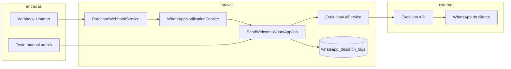
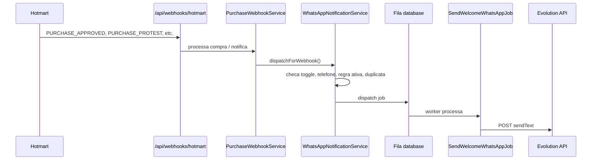

# WhatsApp — Integração Evolution API

**Projeto:** Bible Library (Laravel 13 + Filament 4)  
**Evolution API:** `https://wpp.mediamrkt.online`  
**Instância WhatsApp:** `biblioteca`  
**Site:** `https://mediamrkt.online`

> Este documento descreve **como o projeto envia mensagens WhatsApp**: arquitetura, configuração no admin, fluxo automático (webhook Hotmart), teste manual, fila, logs e solução de problemas.

Documentação relacionada:

- [Deploy Bible Library na VPS](./DEPLOY-VPS-BIBLE-LIBRARY.md) — worker Supervisor, fila `database`
- [Deploy Evolution API na VPS](./DEPLOY-VPS-EVOLUTION-API.md) — Docker, `.env`, API Key, instância

---

## Índice

1. [Visão geral](#1-visão-geral)
2. [Arquitetura](#2-arquitetura)
3. [Configuração no admin](#3-configuração-no-admin)
4. [Como a mensagem é enviada (código)](#4-como-a-mensagem-é-enviada-código)
5. [Dois modos de disparo](#5-dois-modos-de-disparo)
6. [Mapeamento Hotmart → regra de mensagem](#6-mapeamento-hotmart--regra-de-mensagem)
7. [Normalização de telefone](#7-normalização-de-telefone)
8. [Fila e worker (obrigatório em produção)](#8-fila-e-worker-obrigatório-em-produção)
9. [Logs e auditoria](#9-logs-e-auditoria)
10. [Anti-duplicata](#10-anti-duplicata)
11. [Placeholders das mensagens](#11-placeholders-das-mensagens)
12. [O que o projeto não faz](#12-o-que-o-projeto-não-faz)
13. [Solução de problemas](#13-solução-de-problemas)
14. [Referência de arquivos no código](#14-referência-de-arquivos-no-código)

---

## 1. Visão geral

O site **não fala com o WhatsApp diretamente**. Ele usa a **Evolution API** (rodando na VPS) como ponte.

Fluxo resumido:

1. O Laravel recebe um **evento de venda** (webhook Hotmart) **ou** um **teste manual** do admin.
2. Decide **qual mensagem** enviar com base nas regras configuradas.
3. Coloca o envio numa **fila** (`QUEUE_CONNECTION=database`).
4. Um **worker** (Supervisor) processa a fila e chama a Evolution API.
5. Registra o resultado em **Disparos WhatsApp** (`whatsapp_dispatch_logs`).

---

## 2. Arquitetura



### Sequência — envio automático (webhook)



---

## 3. Configuração no admin

### 3.1 Integrações API

**Menu:** Admin → Sistema → **Integrações API**  
**Arquivo:** `app/Filament/Pages/ManageIntegrations.php`  
**Leitura em runtime:** `app/Support/IntegrationSettings.php`

| Campo na tela | Chave no banco | Função |
|---------------|---------------|--------|
| Enviar WhatsApp automático | `whatsapp_enabled` | Liga/desliga envios **reais** via webhook |
| URL base Evolution API | `evolution_base_url` | Ex: `https://wpp.mediamrkt.online` (sem barra no final) |
| Nome da instância | `evolution_instance` | Ex: `biblioteca` — deve ser **idêntico** ao nome no Manager da Evolution |
| API Key | `evolution_api_key` (criptografada) | Deve ser **a mesma** que `AUTHENTICATION_API_KEY` em `/opt/evolution-api/.env` |

> **Importante:** se o campo API Key estiver vazio ao salvar, o valor anterior é mantido. Para trocar a chave, cole o valor novo e salve.

> **Teste manual:** não depende do toggle “Enviar WhatsApp automático”. Só exige Evolution configurada (URL + instância + API Key).

### 3.2 Mensagens WhatsApp

**Menu:** Admin → Sistema → **Mensagens**  
**Arquivo:** `app/Filament/Pages/ManageMessages.php`  
**Tabela:** `whatsapp_message_templates`

Cada **regra** contém:

| Campo | Descrição |
|-------|-----------|
| Condição | Enum `WhatsAppMessageEvent` (ex: venda aprovada, pedido de reembolso) |
| Texto | Corpo da mensagem com placeholders (`{nome}`, `{email}`, etc.) |
| Ativa | `is_enabled` — só regras ativas disparam no automático |

A seção **Status da integração** mostra:

- Evolution API configurada ou não
- Disparo automático global ligado ou desligado

**Botão “Enviar teste”:** escolhe uma regra + telefone e enfileira um job de teste (ver [seção 5.2](#52-b-teste-manual--botão-enviar-teste)).

### 3.3 Disparos WhatsApp

**Menu:** Admin → Sistema → **Disparos WhatsApp**  
**Arquivo:** `app/Filament/Resources/WhatsAppDispatchLogResource.php`  
**Tabela:** `whatsapp_dispatch_logs`

Histórico de cada tentativa: sucesso/falha, HTTP, erro, texto enviado e JSON da Evolution.

---

## 4. Como a mensagem é enviada (código)

### 4.1 EvolutionApiService — chamada HTTP

**Arquivo:** `app/Services/EvolutionApiService.php`

Endpoint usado:

```
POST {evolution_base_url}/message/sendText/{evolution_instance}
```

Headers:

```
apikey: {evolution_api_key}
Content-Type: application/json
```

Body JSON:

```json
{
  "number": "555597284533",
  "text": "Texto da mensagem já renderizado"
}
```

Se a resposta não for 2xx, lança exceção com o corpo da resposta (ex: HTTP 401 Unauthorized).

### 4.2 SendWelcomeWhatsAppJob — job principal

**Arquivo:** `app/Jobs/SendWelcomeWhatsAppJob.php`

Características:

| Propriedade | Valor |
|-------------|-------|
| Fila | `database` (tabela `jobs`) |
| Tentativas | 3 |
| Backoff | 60 segundos entre tentativas |
| Unicidade | `ShouldBeUnique` — evita jobs duplicados na fila |

Fluxo do `handle()`:

1. Carrega usuário e compra (se `purchaseId > 0`)
2. Monta contexto (`NormalizedPurchaseContext`: produto, transação, moeda, valor)
3. Normaliza telefone (`PhoneNumber::normalize`)
4. Renderiza texto (`MessageTemplateService` → `WhatsAppMessageTemplateService`)
5. Verifica se já foi enviado com sucesso (exceto teste manual)
6. Chama `EvolutionApiService::sendText()`
7. Grava log via `WhatsAppDispatchLogService` (sucesso ou falha)

### 4.3 WhatsAppMessageTemplateService — templates

**Arquivo:** `app/Services/WhatsAppMessageTemplateService.php`

- `body()` — texto da regra no banco ou texto padrão do enum
- `isEnabled()` — regra existe e está ativa
- `render()` — substitui placeholders e retorna mensagem final
- `upsert()` / `toggleEnabled()` / `deleteRule()` — CRUD das regras no admin

### 4.4 WhatsAppNotificationService — ponto de entrada do webhook

**Arquivo:** `app/Services/WhatsAppNotificationService.php`

Chamado por `PurchaseWebhookService` após processar o webhook. Só enfileira o job se **todas** as condições forem verdadeiras:

1. `whatsapp_enabled` = ligado (Integrações API)
2. Telefone presente no payload do webhook
3. Evento Hotmart mapeado para uma regra (`WhatsAppMessageEvent::fromHotmartEvent`)
4. Regra existe e está **ativa** (`is_enabled`)
5. Ainda não houve envio com sucesso para aquela compra/evento

---

## 5. Dois modos de disparo

### 5.1 Automático — webhook Hotmart

**Origem:** `PurchaseWebhookService` → `WhatsAppNotificationService::dispatchForWebhook()`  
**Trigger no log:** `purchase_webhook` (Canal: “Compra (webhook)”)

Após o webhook processar a compra, o WhatsApp é acionado em três cenários:

| Ação do webhook | O que o sistema faz | Mensagem típica |
|-----------------|---------------------|-----------------|
| `GrantAccess` | Libera plano + grava compra aprovada | Venda aprovada (Plan Completo) |
| `AcknowledgeFunnel` | Registra order bump sem liberar acesso | Order bump / upsell aprovado |
| `NotifyOnly` | Só registra/loga o evento | Reembolso, cancelamento, carrinho abandonado, etc. |

**URLs de webhook:**

- Hotmart: `https://mediamrkt.online/api/webhooks/hotmart`
- Genérico: `https://mediamrkt.online/api/webhooks/generic`

### 5.2 B) Teste manual — botão “Enviar teste”

**Origem:** `ManageMessages` → `SendWelcomeWhatsAppJob::dispatch()`  
**Trigger no log:** `manual_test` (Canal: “Teste manual”)

Comportamento especial:

| Aspecto | Comportamento |
|---------|---------------|
| Toggle global | **Ignorado** — teste funciona mesmo com automático desligado |
| Usuário no texto | Dados do **admin logado** (`{nome}`, `{email}`) |
| Compra | `purchaseId = 0` — sem compra real |
| Contexto fictício | Produto “Plan Completo — Hotmart”, transação `HP-TEST-{uuid}` |
| Duplicata | **Não bloqueia** — pode testar várias vezes |

Após clicar em “Enviar teste”, a notificação diz: **“Verifique Disparos WhatsApp”**.

---

## 6. Mapeamento Hotmart → regra de mensagem

O adapter Hotmart (`HotmartWebhookAdapter`) define a **ação** do webhook.  
O enum `WhatsAppMessageEvent` define a **mensagem** a enviar.

| Evento Hotmart | Ação webhook | Regra WhatsApp (`message_event`) | Label no admin |
|----------------|--------------|----------------------------------|----------------|
| `PURCHASE_APPROVED` + produto principal | `GrantAccess` | `purchase_approved` | Venda aprovada (Plan Completo) |
| `PURCHASE_APPROVED` + order bump | `AcknowledgeFunnel` | `purchase_funnel` | Order bump / upsell aprovado |
| `PURCHASE_COMPLETE` | `NotifyOnly` | `purchase_complete` | Compra completa (garantia encerrada) |
| `PURCHASE_CANCELED` | `NotifyOnly` | `purchase_canceled` | Compra cancelada |
| `PURCHASE_BILLET_PRINTED` | `NotifyOnly` | `purchase_billet_printed` | Boleto gerado / impresso |
| `PURCHASE_PROTEST` | `NotifyOnly` | `purchase_protest` | Pedido de reembolso |
| `PURCHASE_REFUNDED` | `NotifyOnly` | `purchase_refunded` | Compra reembolsada |
| `PURCHASE_CHARGEBACK` | `NotifyOnly` | `purchase_chargeback` | Chargeback |
| `PURCHASE_EXPIRED` | `NotifyOnly` | `purchase_expired` | Compra expirada |
| `PURCHASE_DELAYED` | `NotifyOnly` | `purchase_delayed` | Pagamento atrasado |
| `PURCHASE_OUT_OF_SHOPPING_CART` | `NotifyOnly` | `purchase_out_of_shopping_cart` | Abandonou checkout (carrinho) |

> Só dispara WhatsApp se existir regra **criada e ativa** para aquele evento. Por padrão nos seeders, apenas “Venda aprovada” vem habilitada; as demais precisam ser criadas/ativadas em **Mensagens WhatsApp**.

**Arquivo do enum:** `app/Enums/WhatsAppMessageEvent.php`

---

## 7. Normalização de telefone

**Arquivo:** `app/Services/Webhooks/PhoneNumber.php`

Origem no webhook Hotmart (`fromHotmartBuyer`):

1. Prioriza `buyer.checkout_phone` + `checkout_phone_code` + país
2. Fallback: campos `phone` ou `phone_number`
3. Remove tudo que não é dígito
4. Exige **mínimo 10 dígitos** — caso contrário, falha com “Número de telefone inválido ou vazio”

No teste manual, o número informado passa por `PhoneNumber::normalize()`.

Exemplos:

| Entrada | Saída |
|---------|-------|
| `57 316 524 7626` | `573165247626` |
| BR com DDD incompleto | Monta `55` + DDD + número quando aplicável |

---

## 8. Fila e worker (obrigatório em produção)

No `.env` de produção:

```env
QUEUE_CONNECTION=database
```

Jobs vão para a tabela `jobs`. **Sem o worker rodando, nada é enviado** — o teste fica apenas “enfileirado”.

### Supervisor

Configuração em `/etc/supervisor/conf.d/bible-library-worker.conf`:

```ini
[program:bible-library-worker]
command=php /var/www/bible-library/artisan queue:work database --sleep=3 --tries=3 --max-time=3600 --timeout=120
user=www-data
stdout_logfile=/var/www/bible-library/storage/logs/worker.log
```

Comandos úteis na VPS:

```bash
supervisorctl status bible-library-worker:*
supervisorctl restart bible-library-worker:*
tail -f /var/www/bible-library/storage/logs/worker.log
```

---

## 9. Logs e auditoria

### 9.1 Tabela `whatsapp_dispatch_logs`

| Campo | Conteúdo |
|-------|----------|
| `trigger` | `purchase_webhook` ou `manual_test` |
| `message_event` | Qual regra (ex: `purchase_protest`) |
| `status` | `sent` (Enviado) ou `failed` (Falhou) |
| `phone` | Número informado |
| `phone_normalized` | Número após normalização |
| `user_id` | Usuário vinculado (comprador ou admin no teste) |
| `purchase_id` | Compra (null em testes) |
| `hotmart_transaction` | Código HP ou `HP-TEST-...` |
| `message` | Texto final enviado (ou que seria enviado) |
| `http_status` | Ex: 200, 401 |
| `error_message` | Erro retornado (ex: corpo da Evolution) |
| `evolution_response` | JSON da resposta em sucesso |
| `attempt` | Tentativa (1 a 3) |
| `created_at` | Data/hora do registro |

### 9.2 Arquivo Laravel

```bash
tail -n 100 /var/www/bible-library/storage/logs/laravel.log
```

Mensagens comuns:

- `WhatsApp enfileirado para o cliente do webhook.`
- `WhatsApp enviado.`
- `WhatsApp não disparado: integração global desligada.`
- `Evolution API falhou ao enviar mensagem.`

---

## 10. Anti-duplicata

Três camadas evitam enviar a mesma mensagem duas vezes para a mesma compra:

1. **Antes de enfileirar** (`WhatsAppNotificationService::wasAlreadySent`) — consulta log com `status = sent` para mesma compra + evento + trigger webhook
2. **No job** (`SendWelcomeWhatsAppJob::wasAlreadySent`) — mesma lógica; **teste manual sempre passa**
3. **Job único** (`ShouldBeUnique`) — chave: `trigger + message_event + purchase/transaction + phone`

---

## 11. Placeholders das mensagens

Use no texto das regras em **Mensagens WhatsApp**:

| Placeholder | Descrição |
|-------------|-----------|
| `{nome}` | Nome do comprador (ou admin no teste) |
| `{email}` | E-mail de acesso |
| `{telefone}` | Telefone do checkout |
| `{producto}` | Nome do produto Hotmart |
| `{link_acceso}` | URL de login (`/login`) |
| `{link_checkout}` | URL de checkout (só regra de carrinho abandonado) |
| `{transacao}` | Código HP da Hotmart |
| `{evento}` | Evento Hotmart (ex: `PURCHASE_APPROVED`) |
| `{moeda}` | Moeda da compra |
| `{valor}` | Valor formatado (ex: `4.90`) |

As mensagens são em **espanhol** para o cliente final.

---

## 12. O que o projeto não faz

- **Não** usa webhook da Evolution para **receber** mensagens dos clientes
- **Não** envia mídia (imagem, áudio, PDF) — apenas texto via `sendText`
- **Não** envia automático se o toggle global estiver desligado (teste manual continua funcionando)
- **Não** envia se a regra não existir ou estiver inativa
- **Não** envia sem telefone válido no webhook
- **Não** altera acesso/plano do cliente por eventos `NotifyOnly` (só notifica)

---

## 13. Solução de problemas

### “Teste enfileirado” mas nada acontece

**Causa:** worker parado.

```bash
supervisorctl status bible-library-worker:*
supervisorctl restart bible-library-worker:*
```

### HTTP 401 — Unauthorized

**Causa:** API Key do admin ≠ `AUTHENTICATION_API_KEY` da Evolution.

```bash
# Na VPS — ver chave real
grep AUTHENTICATION_API_KEY /opt/evolution-api/.env

# Testar chave
API_KEY=$(grep '^AUTHENTICATION_API_KEY=' /opt/evolution-api/.env | cut -d= -f2-)
curl -s -o /dev/null -w "HTTP %{http_code}\n" \
  -H "apikey: $API_KEY" \
  https://wpp.mediamrkt.online/instance/fetchInstances
```

Cole a **mesma** chave em **Integrações API → API Key** e salve.

### Automático não dispara em vendas reais

Verifique:

1. **Integrações API** → “Enviar WhatsApp automático” = **ligado**
2. **Mensagens** → regra do evento = **ativa**
3. Webhook Hotmart com telefone do comprador
4. Worker rodando
5. **Disparos WhatsApp** — pode já ter registro `sent` (anti-duplicata)

### Falhou: telefone inválido

Número com menos de 10 dígitos ou ausente no payload Hotmart.

### Falhou após 3 tentativas

Possíveis causas:

- Evolution API fora do ar (`docker compose ps` em `/opt/evolution-api`)
- Instância WhatsApp desconectada (Manager → QR code)
- Timeout de rede

```bash
cd /opt/evolution-api
docker compose ps
docker logs evolution_api --tail 50
curl -s -o /dev/null -w "HTTP %{http_code}\n" http://127.0.0.1:8080
```

### Onde ver o retorno de um teste

**Admin → Sistema → Disparos WhatsApp** → clique no registro → **Visualizar**

Campos importantes: **Resultado**, **HTTP**, **Erro**, **Resposta Evolution API**.

---

## 14. Referência de arquivos no código

| Arquivo | Responsabilidade |
|---------|------------------|
| `app/Services/EvolutionApiService.php` | POST `sendText` na Evolution |
| `app/Jobs/SendWelcomeWhatsAppJob.php` | Job de envio (fila, retry, log) |
| `app/Services/WhatsAppNotificationService.php` | Enfileira a partir do webhook |
| `app/Services/PurchaseWebhookService.php` | Processa compra e chama WhatsApp |
| `app/Services/WhatsAppMessageTemplateService.php` | Templates, placeholders, regras |
| `app/Services/MessageTemplateService.php` | Facade fina sobre templates |
| `app/Services/WhatsAppDispatchLogService.php` | Grava sucesso/falha no banco |
| `app/Services/Webhooks/PhoneNumber.php` | Normalização de telefone |
| `app/Services/Webhooks/HotmartWebhookAdapter.php` | Parse webhook Hotmart + ação |
| `app/Support/IntegrationSettings.php` | URL, instância, API Key, toggle |
| `app/Enums/WhatsAppMessageEvent.php` | Eventos/regras de mensagem |
| `app/Enums/WhatsAppDispatchTrigger.php` | `manual_test` / `purchase_webhook` |
| `app/Enums/WhatsAppDispatchStatus.php` | `sent` / `failed` |
| `app/Filament/Pages/ManageIntegrations.php` | Tela Integrações API |
| `app/Filament/Pages/ManageMessages.php` | Tela Mensagens + teste |
| `app/Filament/Resources/WhatsAppDispatchLogResource.php` | Tela Disparos WhatsApp |
| `app/Models/WhatsAppMessageTemplate.php` | Model das regras |
| `app/Models/WhatsAppDispatchLog.php` | Model dos logs |

---

## Resumo em uma frase

**Webhook ou teste → fila → job monta mensagem com placeholders → POST na Evolution → WhatsApp do cliente → tudo registrado em Disparos WhatsApp.**
